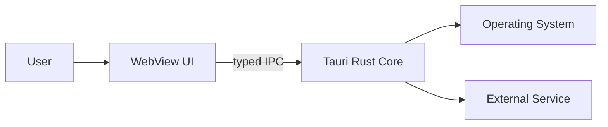
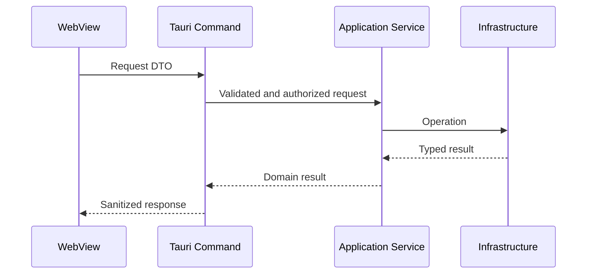

# Architecture: [System or Feature Name]

- **Status:** Draft | Accepted | Superseded
- **Owners:** [Names or team]
- **Last updated:** YYYY-MM-DD
- **Related ADRs:** [Links]
- **Related threat model:** [Link]

## Purpose

[Problem solved and user outcome.]

## Non-goals

[Behavior intentionally excluded.]

## Constraints

[Platforms, compatibility, security, performance, schedule, dependencies.]

## Context

## Components and dependency direction

| Component | Responsibility   | Depends on     | Owns state |
| --------- | ---------------- | -------------- | ---------- |
| [Name]    | [Responsibility] | [Dependencies] | [State]    |

## Primary flows

### [Flow name]

## State and lifecycle

- [State owner]
- [Initialization]
- [Concurrency and queue bounds]
- [Cancellation]
- [Shutdown]
- [Recovery]

## Trust boundaries and permissions

- [Untrusted inputs]
- [Tauri commands]
- [Capabilities and scopes]
- [Secrets]
- [Local or remote network boundary]

## Data and persistence

- [Schema and location]
- [Migration]
- [Atomicity and durability]
- [Retention and deletion]
- [Backup and recovery]

## Error and failure behavior

| Failure   | User-visible behavior | Retry or recovery | Observability |
| --------- | --------------------- | ----------------- | ------------- |
| [Failure] | [Behavior]            | [Policy]          | [Signal]      |

## Performance budgets

| Metric   |   Budget | Measurement method |
| -------- | -------: | ------------------ |
| [Metric] | [Target] | [Method]           |

## Platform matrix

| Platform | Supported behavior | Differences   | Validation |
| -------- | ------------------ | ------------- | ---------- |
| Windows  | [Behavior]         | [Differences] | [Evidence] |
| macOS    | [Behavior]         | [Differences] | [Evidence] |
| Linux    | [Behavior]         | [Differences] | [Evidence] |

## Testing strategy

- [Unit]
- [Integration]
- [Security-negative]
- [Lifecycle]
- [Packaged app]
- [Performance]
- [Platform]

## Operations and release

- [Configuration]
- [Logging and diagnostics]
- [Signing and updater]
- [Rollback]
- [Incident controls]

## Open questions and risks

| Item               | Owner   | Resolution or due date |
| ------------------ | ------- | ---------------------- |
| [Question or risk] | [Owner] | [Plan]                 |
