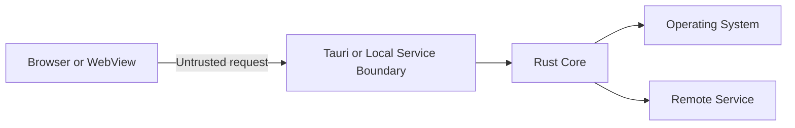

# Threat Model: [System or Feature Name]

- **Status:** Draft | Reviewed | Accepted
- **Owners:** [Names or team]
- **Last reviewed:** YYYY-MM-DD
- **Related architecture:** [Link]

## Scope

[Included components, commands, data, platforms, and release flow.]

## Out of scope

[Explicit assumptions such as a compromised kernel or administrator account.]

## Security objectives

- [Objective]
- [Objective]

## Assets

| Asset   | Sensitivity | Required protection                        |
| ------- | ----------- | ------------------------------------------ |
| [Asset] | [Level]     | [Confidentiality, integrity, availability] |

## Actors and attacker capabilities

| Actor   | Capability   | Intended access |
| ------- | ------------ | --------------- |
| [Actor] | [Capability] | [Access]        |

## Entry points and trust boundaries

| Entry point           | Input   | Authentication | Authorization | Limits                |
| --------------------- | ------- | -------------- | ------------- | --------------------- |
| [Command or endpoint] | [Input] | [Control]      | [Control]     | [Size, rate, timeout] |

## Abuse cases and controls

| ID   | Abuse case | Preconditions | Impact   | Preventive controls | Detection | Test evidence | Residual risk |
| ---- | ---------- | ------------- | -------- | ------------------- | --------- | ------------- | ------------- |
| T-01 | [Scenario] | [Conditions]  | [Impact] | [Controls]          | [Signals] | [Tests]       | [Risk]        |

## Capability and permission review

- Tauri capability files: [Paths]
- Privileged commands: [List]
- Plugin permissions and scopes: [List]
- Remote content or origins: [List]
- Filesystem, shell, process, HTTP, updater, and sidecar access: [Details]

## Secret and data handling

- Secret sources and storage: [Details]
- IPC exposure: [Details]
- Logging and crash-report redaction: [Details]
- Retention and deletion: [Details]

## Local service controls

- Bind address and port: [Details]
- Pairing and session authentication: [Details]
- Origin, host, and protocol checks: [Details]
- Replay and single-client policy: [Details]
- Connection, payload, queue, and rate limits: [Details]
- Shutdown and revocation: [Details]

## Update and supply-chain controls

- Artifact signing and key ownership: [Details]
- Update endpoint and channels: [Details]
- Dependency and CI controls: [Details]

## Unresolved risks

| Risk   | Severity | Owner   | Mitigation or acceptance | Due date |
| ------ | -------- | ------- | ------------------------ | -------- |
| [Risk] | [Level]  | [Owner] | [Plan]                   | [Date]   |

## Review checklist

- [ ] Inputs are validated and authorized in Rust.
- [ ] Capabilities and scopes are least privilege.
- [ ] CSP and remote content are reviewed.
- [ ] Local services are authenticated and bounded.
- [ ] Paths, URLs, arguments, and payloads are constrained.
- [ ] Secrets are excluded from frontend, logs, errors, and repository.
- [ ] Failure, cancellation, and shutdown are safe.
- [ ] Negative tests cover abuse cases.
- [ ] Release and updater integrity are protected.
