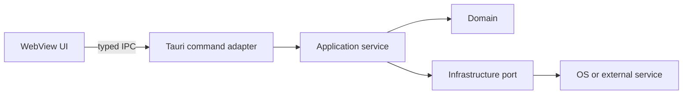
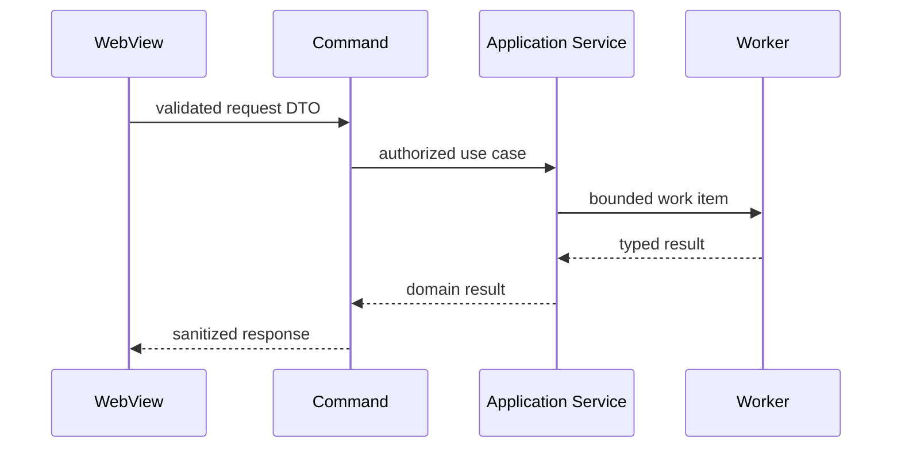

# Documentation Guide

## Contents

1. Proportional documentation
2. Code documentation
3. Architecture overview
4. Architecture decision records
5. Threat models
6. Operational and release documentation
7. Diagram guidance
8. Documentation quality check

## 1. Proportional documentation

Match documentation to decision lifetime and risk.

| Change                         | Expected documentation                                                     |
| ------------------------------ | -------------------------------------------------------------------------- |
| Obvious local fix              | Regression test and concise code comment only if the reason is non-obvious |
| New command or feature         | Public behavior, inputs, errors, permission requirements, tests            |
| New module boundary or service | Module documentation and architecture overview update                      |
| New persistence format         | Schema, migration, compatibility, backup, recovery                         |
| Security-sensitive boundary    | Threat model, controls, residual risk, negative tests                      |
| Performance-sensitive path     | Metric, budget, measurement method, tradeoffs                              |
| Cross-platform behavior        | Supported matrix, platform differences, validation method                  |
| Consequential design choice    | ADR                                                                        |
| Release or updater change      | Signing, key ownership, channels, rollback, runbook                        |

Do not create a document merely because a template exists. Update the nearest durable source of truth.

## 2. Code documentation

Document:

- Module responsibility and dependency direction
- Public API behavior and errors
- Invariants that types cannot express
- Safety contracts for unsafe code
- Concurrency ownership, lock order, cancellation, and shutdown
- Security assumptions and trust boundaries
- Non-obvious performance choices and budgets
- Platform differences
- Compatibility and migration behavior

Prefer explaining why a constraint exists over restating syntax.

Bad:

```rust
// Increment the counter.
counter += 1;
```

Useful:

```rust
// Advance only after the action is durably recorded so reconnect replay cannot
// execute the same privileged action twice.
sequence += 1;
```

Keep comments synchronized with behavior. Remove stale design comments during refactoring.

## 3. Architecture overview

Create or update a durable architecture overview when multiple components or trust boundaries must be understood together. Copy `assets/architecture-template.md` and tailor it.

Cover:

- Purpose and non-goals
- Context and users
- Components and dependency direction
- State ownership and lifecycle
- Main data and control flows
- Tauri commands and privileged operations
- Trust boundaries and capability model
- Persistence and migrations
- Concurrency, background tasks, and shutdown
- Performance budgets
- Observability and failure recovery
- Platform matrix
- Testing and release process
- Links to ADRs and threat models

Describe contracts and invariants, not a folder listing.

## 4. Architecture decision records

Create an ADR when a decision is expensive to reverse, affects several modules, changes a public contract, introduces a dependency or service, alters a security boundary, or accepts a meaningful tradeoff.

Copy `assets/adr-template.md`.

An ADR must contain:

- Status and date
- Context and decision drivers
- Options considered
- Decision
- Security consequences
- Performance consequences
- Compatibility and migration consequences
- Operational consequences
- Rejected alternatives and reason
- Validation and follow-up

Use one decision per ADR. Do not rewrite an accepted ADR to hide history; supersede it with a new ADR and link both.

## 5. Threat models

Create a threat model for local servers, remote content, authentication, updater changes, secret storage, arbitrary file import, process execution, keyboard or device control, multi-tenant data, or other privileged boundaries.

Copy `assets/threat-model-template.md`.

Keep it actionable:

- Name assets and attacker capabilities.
- Draw trust boundaries and entry points.
- List abuse cases, controls, and test evidence.
- Assign owners to unresolved risks.
- State what is explicitly outside the protection boundary.
- Update it when commands, capabilities, origins, endpoints, storage, or release flow changes.

Avoid generic threat lists that do not map to code or configuration.

## 6. Operational and release documentation

Document operator-visible behavior for:

- Configuration and defaults
- Log location, level, redaction, and rotation
- Health and diagnostic signals
- Local port selection and collision behavior
- Data location, backup, migration, and recovery
- Child process and sidecar lifecycle
- Crash and restart behavior
- Updater channels, signing, key rotation, and rollback
- Platform signing and notarization
- Known limitations and unsupported environments

For a security incident, operators must know how to disable a feature, revoke a key or session, stop an update, rotate credentials, and collect safe diagnostics.

## 7. Diagram guidance

Use a diagram only when it explains a relationship faster than prose.

Prefer Mermaid text diagrams in repositories that render them.

Component example:



Sequence example:



Mark trust boundaries, authentication, persistence, queues, and external systems. Do not include decorative details that obscure the decision.

## 8. Documentation quality check

Before delivery, verify:

- A new engineer can identify state owners and privileged boundaries.
- The documented commands and permissions match code and configuration.
- Failure, cancellation, and shutdown behavior is described.
- Security assumptions and residual risks are explicit.
- Performance claims include a metric and evidence.
- Platform support is factual.
- Migration and rollback behavior is clear.
- Diagrams and links are current.
- No secret, token, internal hostname, or sensitive user data appears in examples.
